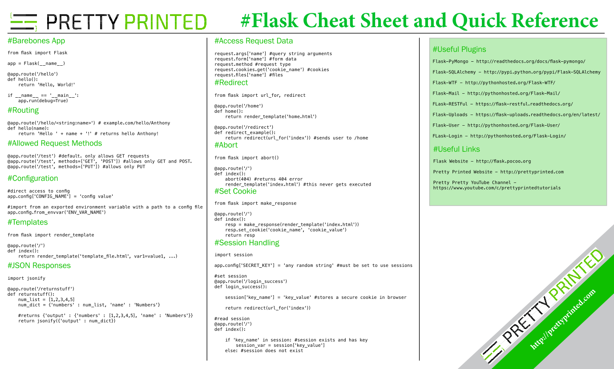

# AirBnB clone v3 - RESTful API

## resources

- [learn REST API design](https://www.restapitutorial.com/)
- [RESTful API with python and flask](https://blog.miguelgrinberg.com/post/designing-a-restful-api-with-python-and-flask)
- [Cross-Origin Resource Sharing](https://developer.mozilla.org/en-US/docs/Web/HTTP/CORS)
- [what are FLASK blueprints](https://stackoverflow.com/questions/24420857/what-are-flask-blueprints-exactly)
- [FLASK documentation](https://palletsprojects.com/projects/flask/)
- [modular applications with blueprints](https://flask.palletsprojects.com/en/stable/blueprints/)
- [testing FLASK applications](https://flask.palletsprojects.com/en/stable/testing/)
- [Flask-CORS documentation](https://flask-cors.readthedocs.io/en/latest/)
- [youtube: 4 Airbnb API - Holberton](https://www.youtube.com/watch?v=LrQhULlFJdU)

## objectives

- what does REST, API, and CORS stand for ?
- what is an API and a REST API ?
- what are other types of APIs ?
- which http method is used for
	- retrieving ?
	- creating ?
	- updating ?
	- deleting ?
- how to request a REST API
